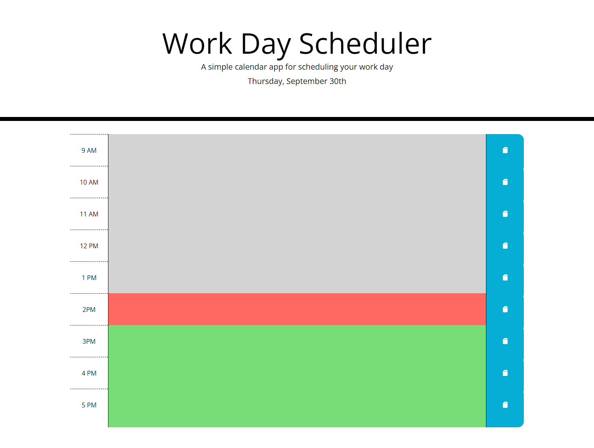

# work-day-scheduler
In this project, I have finalized the functionality  for the given work day planner.  It lists the current day at the top, display current hour block as red, past hours as gray, future as green.  When you click the save button at the end of a row, it saves the text in the row to local storage, and reloads on page refresh.

[Link to deployed app](https://alextheshire.github.io/work-day-scheduler/)
